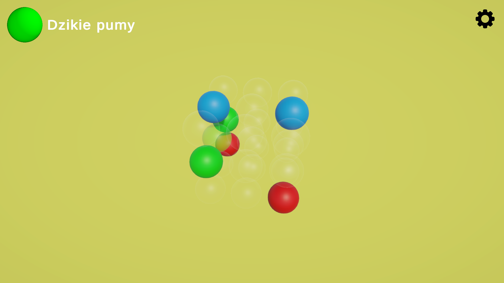
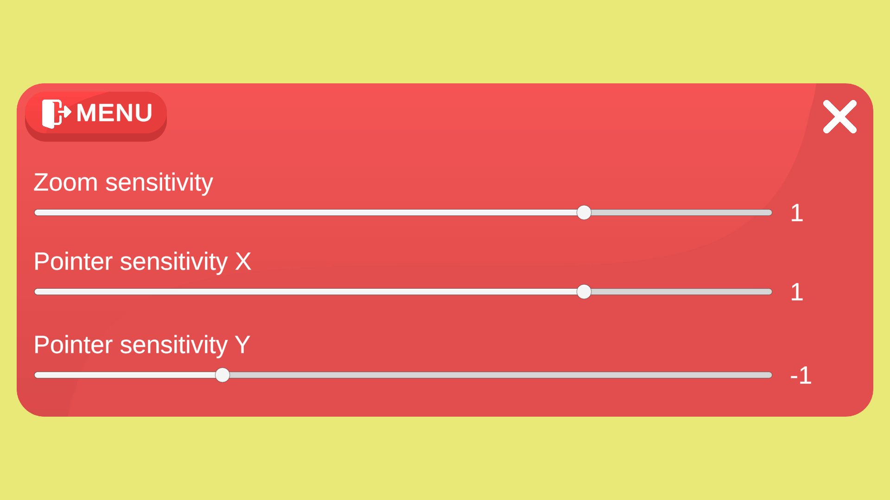

# 🎮 Tic Tac Toe 3D

A **three-player, cross-platform 3D game** developed using the **Unity engine**.  
This project demonstrates a logic-based 3D game with an interactive interface and configurable gameplay options.



---

## 🧩 Game Overview

Upon launching the program, the player is presented with a **main menu** containing four options:

- **START** – begins a new game.  
  Displays a configuration modal allowing the player to set **player names**.
- **SETTINGS** – adjusts **camera zoom** and **rotation sensitivity** across two axes.
- **ABOUT** – displays information about the game and its creators.
- **EXIT** – closes the game.



---

## 🎯 Objective

The goal is to place balls of different colors in 3D space  
to form **a continuous straight line** at any angle.

After each match, a **scoreboard** appears, showing the names of the winners.


---

## 🧠 Technologies & Tools

- **Engine:** Unity `6000.0.60f1`  
- **Language:** C#  
- **Target Platforms:** PC / Web / Mobile  

---

## 📚 Additional Resources

- [Mathematics for Calculating Angles of Intersecting Spheres (YouTube)](https://www.youtube.com/watch?v=ZI0f426X-rA&ab_channel=Mathispower4u)  
- [GitHub Repository](https://github.com/cypekdev/Tic-Tac-Toe-3D)

---

## 🏗️ How to Run

1. Clone or download the repository:
   ```bash
   git clone https://github.com/cypekdev/Tic-Tac-Toe-3D.git
   ```
2. Open the project folder in **Unity (6000.0.60f1)**.
3. Open the main scene (`MainMenu` or `GameScene`).
4. Click **Play ▶** in the Unity Editor or build the project for your target platform.

---

## 📄 License

This project is provided for educational purposes.  
You may freely modify and extend it as long as credit is given to the original author.
